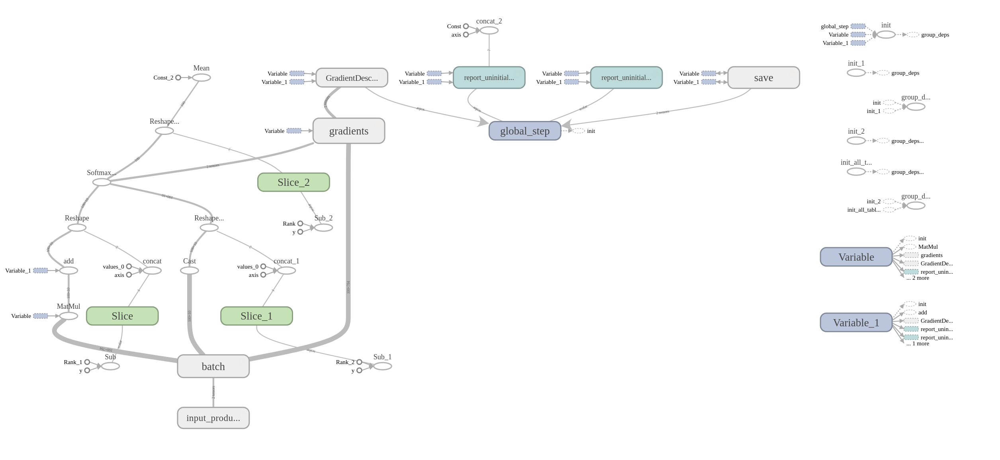
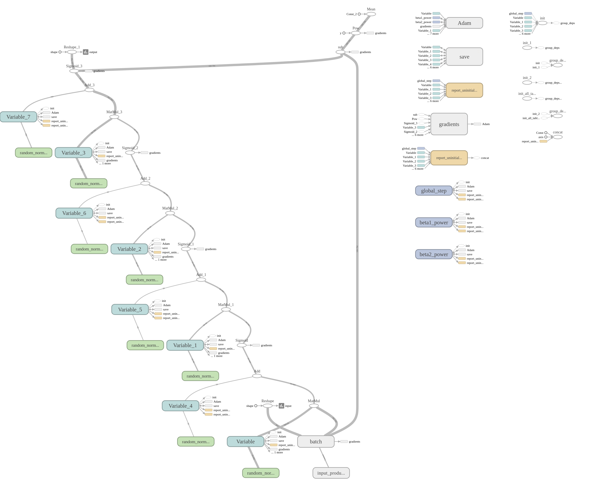

## MNIST Classification with Tensorflow Estimator

#### How to run
- Using Gradient Descent Optimizer: ```> python trainer.py```
- Using Adam Optimizer: ```> python trainer.py --model=autoencoder```

#### TensorBoard
```> python -m tensorflow.tensorboard --logdir=tmp/training```

#### Graph
- Gradient Descent Optimizer

- Adam Optimizer
